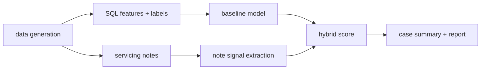

# CaseSignal

CaseSignal is a credit-risk decisioning pipeline built on synthetic data.

It combines structured credit-account behavior with AI-extracted servicing-note signals
to rank accounts by near-term delinquency or escalation risk, explain risk movement,
and support human review.

The project is intentionally scoped as a prototype: the data is synthetic,
the scoring logic is transparent, and the AI component is limited to extracting
auditable note signals rather than making final risk decisions.

## Use case

In lending and servicing workflows, teams need to prioritize which accounts to review first.
CaseSignal models that workflow with:
- a transparent baseline risk score
- note-derived risk indicators from servicing notes
- hybrid score bands and review-ready context

## Architecture



## Why AI is used (and bounded)

AI is used for one narrow task: converting unstructured servicing notes into
structured, auditable indicators (for example hardship mention, income shock language,
or vulnerability context).

AI is not used for final risk decisions.
Final ranking remains deterministic and reviewable:
- baseline structured model score
- note-signal feature block
- explicit hybrid scoring rule

If extraction fails, the pipeline falls back to structured-only scoring.

## Primary project question

Do AI-extracted servicing-note signals improve top-k risk prioritization
over structured features alone?

Core evaluation metrics:
- ROC-AUC
- precision@top-k
- lift@top-k
- reviewer-time proxy

The reviewer-time proxy estimates how many accounts a team would need to review
to capture a fixed share of future escalations.

## Current model comparison

| Model | ROC-AUC | Precision@Top 10% | Lift@Top 10% | Reviewer-time proxy |
| --- | --- | --- | --- | --- |
| Structured baseline | 0.847 | 0.292 | 3.68 | 13.3% (32/240) for 50% escalation capture |
| Structured + servicing-note signals | 0.790 | 0.333 | 4.21 | 14.2% (34/240) for 50% escalation capture |

The table is populated by `scripts/score_hybrid_model_v1.py` and written to `reports/model_results.md`.

## Implementation artifacts

- `reports/model_results.md`
- `docs/model_card.md`
- `docs/ai_controls.md`
- `data/synthetic/servicing_notes_v1.csv`
- `scripts/train_baseline_model_v1.py`
- `scripts/generate_servicing_notes_v1.py`
- `scripts/extract_note_signals_v1.py`
- `scripts/score_hybrid_model_v1.py`
- `scripts/generate_case_summary_v1.py`
- `tests/`

## Current status

Already in place:
- synthetic snapshots and events generation
- SQL feature and label drafts
- training slice export

Core files:
- `scripts/generate_account_snapshots_v1.py`
- `scripts/generate_risk_events_v1.py`
- `scripts/export_training_slice_v1.py`
- `sql/account_month_features_v1.sql`
- `sql/labels_from_events_v1.sql`

## Delivery progress

Completed in repository:
1. structured baseline model training + holdout evaluation
2. synthetic servicing-note generation and deterministic note-signal extraction
3. hybrid scoring with baseline vs note-signal comparison
4. model controls documentation (`docs/model_card.md`, `docs/ai_controls.md`)
5. reproducible artifacts in `data/synthetic/` and `reports/model_results.md`

Current next build item:
1. optional bounded LLM extractor behind the same signal schema and controls
2. calibration and threshold tuning checks for production-like score distributions

## Quick run (current data flow)

Setup:

```bash
python3 -m venv .venv
source .venv/bin/activate
python -m pip install --upgrade pip
pip install -r requirements.txt
```

Run pipeline:

```bash
python3 scripts/generate_account_snapshots_v1.py --rows 1200 --seed 7
python3 scripts/generate_risk_events_v1.py --seed 21
python3 scripts/export_training_slice_v1.py
python3 scripts/generate_servicing_notes_v1.py
python3 scripts/extract_note_signals_v1.py
python3 scripts/train_baseline_model_v1.py
python3 scripts/score_hybrid_model_v1.py
python3 scripts/generate_case_summary_v1.py
```

Run tests:

```bash
python3 -m unittest discover -s tests
```

Check hybrid-score threshold suggestions:

```bash
python3 scripts/check_hybrid_thresholds_v1.py --split test --elevated-quantile 0.85 --high-quantile 0.95
```

Expected outputs:
- `data/synthetic/account_snapshot_v1.csv`
- `data/synthetic/risk_events_v1.csv`
- `data/synthetic/training_slice_v1.csv`
- `data/synthetic/servicing_notes_v1.csv`
- `data/synthetic/note_signals_v1.csv`
- `data/synthetic/baseline_predictions_v1.csv`
- `data/synthetic/hybrid_predictions_v1.csv`
- `data/synthetic/case_summary_v1.csv`
- `data/synthetic/model_metrics_v1.json`
- `reports/model_results.md`

## Roadmap

Detailed build plan: `docs/ai_workflow_roadmap.md`.
